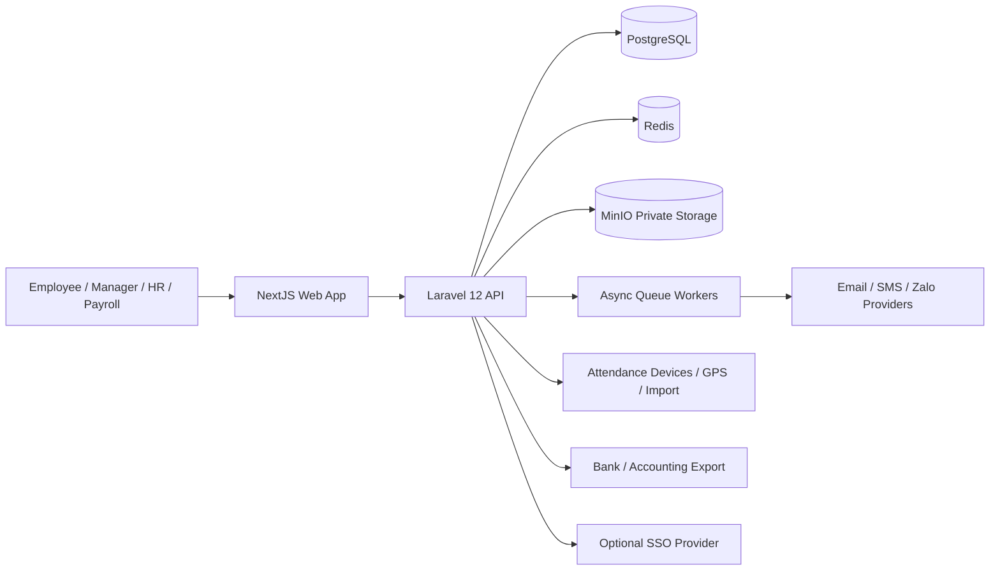

# Enterprise Software Requirements Specification — eHRM

Version: 0.1  
Date: 2026-06-30  
Status: Draft for review

## 1. Introduction

### 1.1 Purpose

This document defines the enterprise-level software requirements for the eHRM system. It is the controlling specification for scope, architecture assumptions, stakeholder needs, cross-module requirements, non-functional requirements, security posture, data governance, and phased delivery.

Detailed requirements are split into phase-specific SRS documents:

- `01-core-platform-srs.md`
- `02-workforce-ops-srs.md`
- `03-talent-lifecycle-srs.md`
- `04-enterprise-extensions-srs.md`

This document intentionally does not describe every screen, field, endpoint, or database table. Those details belong in phase SRS documents, implementation plans, API contracts, and test specifications.

### 1.2 Product Scope

The product is a single-tenant eHRM platform for one enterprise with multiple branches, offices, departments, teams, job positions, reporting lines, and HR operational workflows.

The system supports the full employee lifecycle:

```text
Recruitment -> Offer -> Onboarding -> Employee Master -> Contract
          -> Attendance / Shift / Leave / Payroll
          -> Performance / Training / Asset
          -> Transfer / Promotion / Offboarding -> Archived Employee
```

The initial delivery strategy uses four phases:

1. Core Platform
2. Workforce Operations
3. Talent Lifecycle
4. Enterprise Extensions

### 1.3 Intended Audience

This SRS is intended for:

- Business owners and executives
- HR leaders
- HR operations teams
- Payroll/accounting teams
- Department managers
- Product managers
- Business analysts
- Solution architects
- Backend/frontend/mobile engineers
- QA engineers
- Security reviewers
- DevOps/SRE teams

### 1.4 References

- `docs/ROADMAP.md`
- `docs/ROADMAP_DETAIL_1.md`
- `docs/ROADMAP_DETAIL_2.md`
- ISO/IEC/IEEE 29148: Systems and software engineering — Life cycle processes — Requirements engineering

### 1.5 Definitions

| Term       | Definition                                                                                                     |
|------------|----------------------------------------------------------------------------------------------------------------|
| Employee   | A person employed or previously employed by the company.                                                       |
| User       | A person who authenticates into the system. An employee may or may not be a user.                              |
| Role       | A named permission bundle, such as HR Manager or Employee.                                                     |
| Permission | A specific action allowed by the system.                                                                       |
| Data scope | The subset of data a user may access, based on self, department, branch, reporting line, or all-company scope. |
| Workflow   | A configured approval process with steps, approvers, conditions, and outcomes.                                 |
| PII        | Personally identifiable information, including identity, contact, payroll, tax, insurance, and document data.  |
| Audit log  | Immutable record of user/system actions.                                                                       |
| MinIO      | Object storage service used for private employee documents and generated files.                                |

## 2. Overall Description

### 2.1 Product Perspective

The eHRM platform is an internal enterprise business application. It centralizes HR master data, workforce operations, payroll support, talent lifecycle workflows, and reporting.

The product is API-first:

- Backend: Laravel 12, PHP 8.4
- Frontend: NextJS
- Database: PostgreSQL
- Cache/queue/session/rate-limit support: Redis
- File storage: MinIO private object storage

The backend follows modular monolith architecture. Domains are separated by module boundaries but deployed as one application in the early phases.

### 2.2 Product Functions

At enterprise level, the system shall provide:

- Identity, authentication, roles, permissions, and data-scope authorization
- Organization structure management
- Employee master data and lifecycle tracking
- Employment contract management
- Employee document management
- Attendance and timekeeping
- Shift and schedule management
- Leave management
- Shared approval workflow engine
- Notification/event center
- Payroll calculation support and payslip publication
- Recruitment, onboarding, offboarding
- Performance, training, asset management
- Reports and dashboards
- System configuration and master data
- Audit, security, import/export, and integrations

### 2.3 User Classes

| User class         | Summary                                                                      |
|--------------------|------------------------------------------------------------------------------|
| Admin              | Configures system settings, roles, permissions, and master data.             |
| HR Manager         | Owns HR operations, employee master data, contracts, approvals, and reports. |
| HR Staff           | Maintains HR records within assigned data scope.                             |
| Department Manager | Views and approves requests for direct/department employees.                 |
| Employee           | Uses self-service profile, leave, attendance, payslip, and requests.         |
| Accountant/Payroll | Processes salary, allowances, deductions, payroll reports, and exports.      |
| Recruiter          | Manages job openings, candidates, interviews, and offers.                    |
| Interviewer        | Reviews candidates and submits interview scorecards.                         |
| Trainer            | Manages training programs, enrollment, attendance, and results.              |
| IT/Admin Support   | Handles account provisioning, assets, and offboarding support tasks.         |

### 2.4 Operating Environment

The production environment should support:

- Linux-based containers
- Docker Compose for development/staging
- Kubernetes or equivalent orchestration for production if required
- PostgreSQL 16 or newer
- Redis 7 or newer
- MinIO private buckets
- HTTPS termination
- Scheduled jobs and queue workers
- Centralized logs and backups

### 2.5 Design Constraints

The system shall:

- Use Laravel 12 and PHP 8.4 for backend business rules.
- Use NextJS for frontend web application.
- Use PostgreSQL as the primary relational datastore.
- Use Redis for cache, queues, sessions, locks, and rate limiting where appropriate.
- Use MinIO for employee documents and generated private files.
- Keep backend as a modular monolith until operational evidence justifies service extraction.
- Enforce authorization at API/backend layer, not only in UI.
- Avoid hard-coded HR policies where configuration is practical and safe.

### 2.6 Assumptions

- The first product mode is single-tenant: one enterprise per installation.
- Target scale is 500–2,000 active employees.
- Vietnamese labor, tax, insurance, and HR practices are the baseline compliance context.
- Multi-tenant SaaS is not in initial scope.
- Full microservice architecture is not in initial scope.
- Mobile app is not required in phase 1, but API design should not block future mobile clients.

## 3. System Context



### 3.1 External Systems

The system may integrate with:

- Email/SMS/Zalo notification providers
- Fingerprint/FaceID/GPS attendance sources
- Bank transfer file formats
- Accounting systems
- SSO identity providers
- Document signing services
- Tax/insurance reporting exports

### 3.2 Integration Principles

- User-facing operations should use synchronous APIs.
- Long-running operations should use queues.
- Imports must validate before committing data.
- Exports must be audited.
- External provider failures must not corrupt HR master data.
- Integration credentials must be encrypted and access-controlled.

## 4. Functional Requirements Summary

### 4.1 Core Platform

The system shall provide:

- Authentication and session management
- Role and permission management
- Data-scope authorization
- Organization structure management
- Employee profile and lifecycle management
- Contract and document management
- Configuration and master data
- Immutable audit logs

Detailed requirements: `01-core-platform-srs.md`.

### 4.2 Workforce Operations

The system shall provide:

- Attendance capture and raw log processing
- Shift templates and work schedules
- Leave request and balance tracking
- Approval workflow engine
- Notifications
- Payroll calculation and payroll lock
- Operational dashboards and reports

Detailed requirements: `02-workforce-ops-srs.md`.

### 4.3 Talent Lifecycle

The system shall provide:

- Recruitment requisitions and candidate pipeline
- Interview scheduling and scorecards
- Offer management
- Onboarding checklists
- Offboarding checklists
- Performance review cycles
- Training programs
- Asset assignment and return tracking

Detailed requirements: `03-talent-lifecycle-srs.md`.

### 4.4 Enterprise Extensions

The system shall provide or prepare for:

- SSO and advanced identity controls
- Advanced integrations
- Mobile self-service
- Advanced analytics
- Compliance extensions
- Multi-branch hardening
- Large-scale data partitioning and archiving

Detailed requirements: `04-enterprise-extensions-srs.md`.

## 5. Cross-Module Business Rules

### 5.1 Employee as Master Entity

Employee identity is the central entity. Modules such as contract, attendance, leave, payroll, performance, training, asset, and offboarding must reference employee records rather than duplicating employee identity data.

### 5.2 Effective-Dated Data

Changes to important employment facts must support effective dates when those facts affect payroll, benefits, reporting, or approval authority. Examples:

- Department transfer
- Position change
- Manager change
- Salary change
- Employment status change
- Branch change

### 5.3 Auditability

All create, update, delete, approval, import, export, login, failed login, file download, and permission-changing actions must be auditable.

### 5.4 Data Scope

Users may only access data allowed by their permissions and data scope. Data scope must support at least:

- Self
- Direct reports
- Department
- Branch
- All company

### 5.5 Workflow Consistency

Requests that require approval must have a stable state model. Approved records must not be silently changed without audit and, where required, reverse/cancel/reopen workflow.

## 6. External Interface Requirements

### 6.1 Web Interface

The NextJS frontend shall provide responsive web screens for HR, manager, employee, and admin workflows. The UI must not be the sole enforcement point for permissions.

### 6.2 API Interface

The Laravel backend shall expose secure HTTP APIs. APIs must:

- Authenticate callers
- Authorize every protected operation
- Validate request payloads
- Return consistent errors
- Support pagination/filtering/sorting for list endpoints
- Avoid leaking unauthorized PII in errors or metadata

### 6.3 File Interface

Files shall be stored in MinIO private buckets. Direct public bucket access is not allowed. Users shall access files through time-limited signed URLs or streamed authorized downloads.

### 6.4 Batch Interface

Batch operations such as import, export, payroll processing, and notification fan-out shall run asynchronously where needed and expose processing status.

## 7. Non-Functional Requirements

### 7.1 Performance

- Common API read operations should respond within 500 ms at p95 under normal load.
- Common API write operations should respond within 1,000 ms at p95 under normal load.
- Large imports, payroll calculations, and report exports may run asynchronously.
- List endpoints must support pagination.
- Attendance and payroll tables must be designed for monthly growth.

### 7.2 Scalability

- The system shall support 500–2,000 active employees in the initial enterprise target.
- Backend workers shall scale horizontally for queue workloads.
- Database indexes must cover common filters such as employee code, status, department, branch, date range, and request status.

### 7.3 Availability

- The system shall protect HR master data, payroll data, documents, and audit logs from data loss.
- Database backups shall run at least daily.
- Backup retention shall be at least 30 days for phase 1.
- Recovery procedures shall be documented before production launch.

### 7.4 Security

The system shall implement:

- Strong password policy or SSO when enabled
- Secure session handling
- Backend permission enforcement
- Data-scope checks
- Rate limiting for sensitive endpoints
- Encryption of secrets
- Private object storage
- Audit logging
- PII masking where appropriate
- Least-privilege admin access

### 7.5 Privacy

The system shall restrict access to PII, salary, tax, insurance, identity documents, and bank data. Sensitive exports and file downloads must be logged.

### 7.6 Maintainability

The backend shall be organized by domain modules. Each module should keep business rules close to its domain boundary and avoid uncontrolled cross-module database coupling.

### 7.7 Observability

The system should expose application logs, queue failures, job durations, authentication failures, integration errors, and key business operation metrics.

## 8. Data Governance

### 8.1 Data Ownership

- HR owns employee master data.
- Payroll/accounting owns payroll processing data.
- Department managers own approval decisions for scoped team workflows.
- Admin owns system configuration.

### 8.2 Data Retention

Retention periods must support Vietnamese labor and accounting practices. Exact retention durations may be configured by policy and refined before production.

### 8.3 Data Integrity

The system shall use database constraints, validation, and transaction boundaries to prevent orphaned critical records and inconsistent employee lifecycle states.

## 9. Release Roadmap

### Phase 1 — Core Platform

Build identity, organization, employee master, contracts, documents, configuration, and audit.

### Phase 2 — Workforce Operations

Build attendance, shifts, leave, workflow, notification, payroll basics, and reports.

### Phase 3 — Talent Lifecycle

Build recruitment, onboarding, offboarding, performance, training, and asset management.

### Phase 4 — Enterprise Extensions

Build SSO, advanced integrations, mobile readiness, analytics, compliance extensions, and scale hardening.

## 10. Acceptance Criteria

The enterprise SRS is acceptable when:

- All modules from the roadmap map into one of the four phases.
- Cross-cutting concerns are explicitly defined.
- Architecture assumptions match Laravel 12, PHP 8.4, NextJS, PostgreSQL, Redis, and MinIO.
- Security, audit, data-scope, and privacy baselines are present.
- Phase SRS documents can be written without redefining enterprise context.
