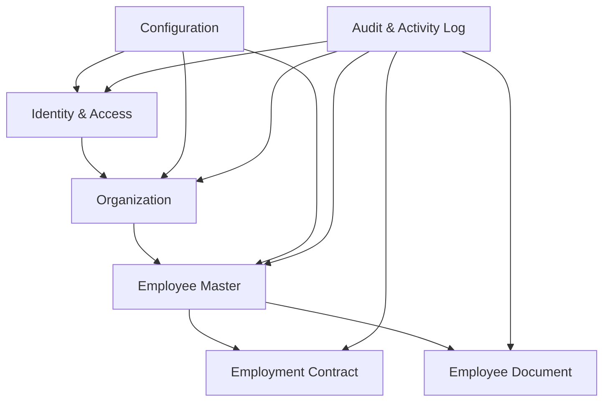

# Phase 1 Software Requirements Specification — Core Platform

Version: 0.1  
Date: 2026-06-30  
Status: Draft for review

## 1. Introduction

### 1.1 Purpose

This document defines the software requirements for Phase 1 of the eHRM system: Core Platform. Phase 1 establishes the data, security, configuration, and audit foundation required by all later phases.

### 1.2 Scope

Phase 1 includes:

1. Identity & Access
2. Organization
3. Employee Master
4. Employment Contract
5. Employee Document
6. Configuration
7. Audit & Activity Log

Phase 1 excludes:

- Attendance calculation
- Shift scheduling
- Leave balance calculation
- Payroll calculation
- Recruitment pipeline
- Onboarding/offboarding task automation
- Performance management
- Training management
- Asset management
- Mobile application
- Multi-tenant SaaS

### 1.3 References

- `00-enterprise-srs.md`
- `docs/ROADMAP.md`
- `docs/ROADMAP_DETAIL_1.md`
- `docs/ROADMAP_DETAIL_2.md`

### 1.4 Assumptions

- The enterprise context is single-tenant.
- Backend uses Laravel 12 and PHP 8.4.
- Frontend uses NextJS.
- PostgreSQL is the primary relational datastore.
- Redis supports cache, session, queue, lock, and rate-limit needs.
- MinIO stores private employee files.
- Phase 1 must be production-grade enough to support later workforce and payroll modules.

## 2. System Overview

### 2.1 Phase Boundary

Phase 1 creates trusted master data and access control. Later phases must depend on Phase 1 rather than defining their own identity, organization, employee, document, configuration, or audit models.



### 2.2 Primary Actors

| Actor              | Phase 1 responsibilities                                                 |
|--------------------|--------------------------------------------------------------------------|
| Admin              | Configure roles, permissions, master data, system settings.              |
| HR Manager         | Manage organization, employees, contracts, documents, reports.           |
| HR Staff           | Maintain employee data within assigned scope.                            |
| Department Manager | View scoped employee records and reporting lines.                        |
| Employee           | View own profile and allowed documents.                                  |
| Accountant/Payroll | View approved employee and contract data needed for later payroll setup. |

### 2.3 Phase 1 Success Outcome

At the end of Phase 1, HR can create the organization structure, create employees, attach contracts and documents, enforce scoped access, and prove every material change through audit logs.

## 3. Functional Requirements

## 3.1 Identity & Access

### 3.1.1 Description

The system shall provide secure user authentication, session management, role assignment, permission management, and data-scope authorization.

### 3.1.2 Functional Requirements

| ID         | Requirement                                                                                                                              |
|------------|------------------------------------------------------------------------------------------------------------------------------------------|
| IAM-FR-001 | The system shall allow authorized admins to create, update, disable, and reactivate user accounts.                                       |
| IAM-FR-002 | The system shall support login and logout using secure session or token-based authentication.                                            |
| IAM-FR-003 | The system shall enforce password policy for local accounts.                                                                             |
| IAM-FR-004 | The system shall support role assignment to users.                                                                                       |
| IAM-FR-005 | The system shall support permission definitions grouped by module and action.                                                            |
| IAM-FR-006 | The system shall support data scopes: self, direct reports, department, branch, and all company.                                         |
| IAM-FR-007 | The system shall evaluate permissions and data scope on protected backend APIs.                                                          |
| IAM-FR-008 | The system shall log successful login, failed login, logout, password change, role change, permission change, and account status change. |
| IAM-FR-009 | The system shall allow admins to force-disable a user account.                                                                           |
| IAM-FR-010 | The system shall prevent disabled users from authenticating.                                                                             |

### 3.1.3 Business Rules

- A user may have multiple roles.
- Permissions are additive unless a future explicit deny model is introduced.
- Employee self-service access requires a linked employee record.
- Disabling a user account must not delete the linked employee record.
- Role and permission changes must be audited with before/after values.

### 3.1.4 Data Model Sketch

Core entities:

- User
- Role
- Permission
- UserRole
- RolePermission
- DataScopeAssignment
- LoginSession

Key attributes:

- User: id, employee_id, name, email, password_hash, status, last_login_at
- Role: id, code, name, description, active
- Permission: id, module, action, code
- DataScopeAssignment: user_id, scope_type, branch_id, department_id, effective_from, effective_to

### 3.1.5 Use Case — Admin Assigns HR Manager Role

Preconditions:

- Admin is authenticated.
- Admin has permission to manage users and roles.

Main flow:

1. Admin opens user detail.
2. Admin selects HR Manager role.
3. Admin selects data scope, such as all company or branch.
4. System validates role and scope.
5. System saves assignment.
6. System records audit log with before/after values.

Postconditions:

- The user receives HR Manager permissions within assigned data scope.
- Future API access uses the updated role/scope.

## 3.2 Organization

### 3.2.1 Description

The system shall manage company structure including company profile, branches/offices, departments, positions, and reporting lines.

### 3.2.2 Functional Requirements

| ID         | Requirement                                                                                           |
|------------|-------------------------------------------------------------------------------------------------------|
| ORG-FR-001 | The system shall store company profile information.                                                   |
| ORG-FR-002 | The system shall allow authorized users to create, update, deactivate, and view branches/offices.     |
| ORG-FR-003 | The system shall allow authorized users to create, update, deactivate, and view departments.          |
| ORG-FR-004 | The system shall support hierarchical departments.                                                    |
| ORG-FR-005 | The system shall allow authorized users to create, update, deactivate, and view positions/job titles. |
| ORG-FR-006 | The system shall support reporting line assignment between employees.                                 |
| ORG-FR-007 | The system shall prevent circular department hierarchy.                                               |
| ORG-FR-008 | The system shall prevent circular manager reporting lines.                                            |
| ORG-FR-009 | The system shall provide organization chart data for UI rendering.                                    |
| ORG-FR-010 | The system shall audit changes to organization entities.                                              |

### 3.2.3 Business Rules

- A branch may contain multiple departments.
- A department may belong to a parent department.
- A position may be reused across departments.
- Deactivated organization records remain available for historical employee records.
- Reporting-line changes may be effective-dated when used for approval or data scope.

### 3.2.4 Data Model Sketch

Core entities:

- Company
- Branch
- Department
- Position
- EmployeeReportingLine

Key attributes:

- Branch: id, code, name, address, active
- Department: id, code, name, parent_id, branch_id, active
- Position: id, code, name, grade, active
- EmployeeReportingLine: employee_id, manager_id, type, effective_from, effective_to

### 3.2.5 Use Case — HR Creates Department Hierarchy

Preconditions:

- HR user is authenticated and authorized.
- Branch exists.

Main flow:

1. HR opens organization management.
2. HR creates a parent department.
3. HR creates child departments under the parent.
4. System validates department code uniqueness.
5. System validates hierarchy has no cycle.
6. System saves departments.
7. System records audit logs.

Postconditions:

- Department hierarchy is available for employee assignment and data-scope checks.

## 3.3 Employee Master

### 3.3.1 Description

The system shall manage employee master records, personal information, employment information, status, lifecycle transitions, and history.

### 3.3.2 Functional Requirements

| ID         | Requirement                                                                                                                      |
|------------|----------------------------------------------------------------------------------------------------------------------------------|
| EMP-FR-001 | The system shall allow authorized HR users to create employee profiles.                                                          |
| EMP-FR-002 | The system shall generate or validate unique employee codes.                                                                     |
| EMP-FR-003 | The system shall store personal information including full name, date of birth, gender, phone, email, and address.               |
| EMP-FR-004 | The system shall store employment information including branch, department, position, manager, hire date, and employment status. |
| EMP-FR-005 | The system shall support employee statuses: draft, onboarding, probation, active, suspended, resigned, archived.                 |
| EMP-FR-006 | The system shall allow authorized users to update employee data within their data scope.                                         |
| EMP-FR-007 | The system shall maintain history for department, position, manager, branch, and status changes.                                 |
| EMP-FR-008 | The system shall allow employees to view their own allowed profile data.                                                         |
| EMP-FR-009 | The system shall restrict access to sensitive fields such as salary, bank, tax, insurance, and identity data.                    |
| EMP-FR-010 | The system shall audit employee create/update/status-change operations.                                                          |

### 3.3.3 Business Rules

- Employee code must be unique.
- Employee email should be unique when used for login.
- An employee may exist without a user account.
- An active user account linked to an employee must respect employee status policies.
- Resigned employees remain searchable by authorized HR users.
- Historical records must remain stable after transfers or status changes.

### 3.3.4 Data Model Sketch

Core entities:

- Employee
- EmployeeContact
- EmployeeAddress
- EmployeeIdentity
- EmployeeEmployment
- EmployeeHistory
- EmployeeEmergencyContact

Key attributes:

- Employee: id, employee_code, full_name, dob, gender, personal_email, work_email, phone, status
- EmployeeEmployment: employee_id, branch_id, department_id, position_id, manager_id, hire_date, employment_type
- EmployeeHistory: employee_id, change_type, old_value, new_value, effective_date, reason, changed_by

### 3.3.5 State Model

```text
Draft -> Onboarding -> Probation -> Active -> Resigned -> Archived
Draft -> Active
Active -> Suspended -> Active
Active -> Resigned
Probation -> Resigned
```

### 3.3.6 Use Case — HR Creates Employee Profile

Preconditions:

- HR user is authenticated and authorized.
- Branch, department, and position exist.

Main flow:

1. HR opens employee create form.
2. HR enters personal and employment data.
3. System validates required fields and unique employee code.
4. System validates selected organization records are active.
5. System creates employee profile.
6. System records initial employment history.
7. System records audit log.

Postconditions:

- Employee profile exists in draft, onboarding, probation, or active status.
- Employee can be linked to contract and documents.

## 3.4 Employment Contract

### 3.4.1 Description

The system shall manage employment contracts, contract types, contract dates, renewal/expiry tracking, attached files, and contract history.

### 3.4.2 Functional Requirements

| ID         | Requirement                                                                                                                             |
|------------|-----------------------------------------------------------------------------------------------------------------------------------------|
| CON-FR-001 | The system shall allow authorized HR users to create employment contracts for employees.                                                |
| CON-FR-002 | The system shall support contract types: probation, definite term, indefinite term, seasonal, collaborator, and other configured types. |
| CON-FR-003 | The system shall store contract number, start date, end date, sign date, status, and attachment reference.                              |
| CON-FR-004 | The system shall track contract statuses: draft, active, expired, terminated, renewed, cancelled.                                       |
| CON-FR-005 | The system shall detect contracts nearing expiry based on configurable thresholds.                                                      |
| CON-FR-006 | The system shall support contract renewal by creating a new version or successor contract.                                              |
| CON-FR-007 | The system shall preserve historical contracts after employee transfer or resignation.                                                  |
| CON-FR-008 | The system shall audit contract create/update/status-change operations.                                                                 |

### 3.4.3 Business Rules

- An active employee may have zero or more historical contracts, but only valid active contracts should be treated as current.
- Contract end date is optional for indefinite contracts.
- Renewal must not overwrite the historical contract period.
- Contract file access must follow document permission rules.

### 3.4.4 Data Model Sketch

Core entities:

- EmploymentContract
- ContractType
- ContractAttachment

Key attributes:

- EmploymentContract: id, employee_id, contract_number, contract_type_id, start_date, end_date, sign_date, status, predecessor_contract_id
- ContractType: id, code, name, requires_end_date, active

### 3.4.5 Use Case — HR Renews Contract

Preconditions:

- Existing contract belongs to employee.
- HR user has contract management permission.

Main flow:

1. HR opens expiring contract.
2. HR selects renew action.
3. System creates successor contract draft with copied base data.
4. HR updates dates and terms.
5. System validates dates do not conflict with business rules.
6. HR activates successor contract.
7. System marks previous contract as renewed when applicable.
8. System records audit logs.

Postconditions:

- New contract is active or draft depending on HR action.
- Previous contract remains historical.

## 3.5 Employee Document

### 3.5.1 Description

The system shall store and protect employee documents such as identity cards, contracts, certificates, degrees, scanned files, and other HR attachments.

### 3.5.2 Functional Requirements

| ID         | Requirement                                                                                               |
|------------|-----------------------------------------------------------------------------------------------------------|
| DOC-FR-001 | The system shall allow authorized users to upload employee documents to MinIO private storage.            |
| DOC-FR-002 | The system shall store document metadata in PostgreSQL.                                                   |
| DOC-FR-003 | The system shall support document categories and types.                                                   |
| DOC-FR-004 | The system shall support document expiry date when applicable.                                            |
| DOC-FR-005 | The system shall restrict document view/download by permission and data scope.                            |
| DOC-FR-006 | The system shall provide time-limited signed URLs or authorized streamed downloads.                       |
| DOC-FR-007 | The system shall record file upload, download, replace, delete, and expiry-update actions in audit logs.  |
| DOC-FR-008 | The system shall support soft delete or archival rather than physical deletion for governed HR documents. |
| DOC-FR-009 | The system shall reject unsupported file types and files exceeding configured size limits.                |

### 3.5.3 Business Rules

- Employee documents are private by default.
- Direct public MinIO access is forbidden.
- Sensitive document categories may require stronger permissions than general employee profile access.
- Replacing a file must keep prior metadata or version history when needed for compliance.
- Physical deletion requires privileged admin action and must be audited.

### 3.5.4 Data Model Sketch

Core entities:

- EmployeeDocument
- DocumentType
- DocumentCategory
- FileObject

Key attributes:

- EmployeeDocument: id, employee_id, document_type_id, file_object_id, issue_date, expiry_date, status
- FileObject: id, storage_disk, bucket, object_key, original_name, mime_type, size, checksum, uploaded_by

### 3.5.5 Use Case — HR Uploads Identity Document

Preconditions:

- Employee exists.
- HR user has document upload permission for employee data scope.

Main flow:

1. HR opens employee document tab.
2. HR selects identity document type.
3. HR uploads file and enters issue/expiry metadata.
4. System validates file type and size.
5. System stores file in MinIO private bucket.
6. System stores metadata in PostgreSQL.
7. System records audit log.

Postconditions:

- Document is available to authorized users only.
- Expiry date can be used for future alerts.

## 3.6 Configuration

### 3.6.1 Description

The system shall provide administrative configuration for master data and reusable rules needed by Phase 1 and future phases.

### 3.6.2 Functional Requirements

| ID         | Requirement                                                                                                                       |
|------------|-----------------------------------------------------------------------------------------------------------------------------------|
| CFG-FR-001 | The system shall allow authorized admins to manage lookup values.                                                                 |
| CFG-FR-002 | The system shall support configurable employee code generation rules.                                                             |
| CFG-FR-003 | The system shall support configurable contract types.                                                                             |
| CFG-FR-004 | The system shall support configurable document types and categories.                                                              |
| CFG-FR-005 | The system shall support holiday calendar setup for future attendance/leave use.                                                  |
| CFG-FR-006 | The system shall support configurable notification thresholds for contract/document expiry.                                       |
| CFG-FR-007 | The system shall audit configuration changes.                                                                                     |
| CFG-FR-008 | The system shall prevent deletion of configuration values already used by historical records; deactivation shall be used instead. |

### 3.6.3 Business Rules

- Configuration values used by existing records must remain historically resolvable.
- Code generation rules must prevent duplicate employee codes.
- System-critical permissions and modules should not be accidentally deleted through UI.

### 3.6.4 Data Model Sketch

Core entities:

- SystemSetting
- LookupGroup
- LookupValue
- CodeGenerationRule
- HolidayCalendar
- Holiday

Key attributes:

- LookupValue: id, group_code, code, name, sort_order, active
- CodeGenerationRule: id, entity_type, prefix, pattern, sequence_padding, next_number, active

### 3.6.5 Use Case — Admin Configures Employee Code Rule

Preconditions:

- Admin has configuration permission.

Main flow:

1. Admin opens code generation settings.
2. Admin selects employee entity.
3. Admin defines prefix, pattern, and sequence length.
4. System validates pattern.
5. System saves rule.
6. System audits change.

Postconditions:

- New employee records can use generated employee codes.

## 3.7 Audit & Activity Log

### 3.7.1 Description

The system shall record immutable audit logs for security, accountability, compliance, and troubleshooting.

### 3.7.2 Functional Requirements

| ID         | Requirement                                                                                                                                                                                        |
|------------|----------------------------------------------------------------------------------------------------------------------------------------------------------------------------------------------------|
| AUD-FR-001 | The system shall record audit logs for create, update, delete, status change, login, failed login, logout, role change, permission change, file upload, file download, import, and export actions. |
| AUD-FR-002 | Each audit log shall include actor, action, target entity, timestamp, request metadata, and result.                                                                                                |
| AUD-FR-003 | Data change audit logs shall include before and after values for changed fields where safe and practical.                                                                                          |
| AUD-FR-004 | Audit logs shall be append-only for normal application users.                                                                                                                                      |
| AUD-FR-005 | The system shall restrict audit log viewing to authorized users.                                                                                                                                   |
| AUD-FR-006 | The system shall support filtering audit logs by actor, action, module, entity, date range, and result.                                                                                            |
| AUD-FR-007 | The system shall prevent sensitive secret values from being written to audit logs.                                                                                                                 |

### 3.7.3 Business Rules

- Audit logs must not be editable through normal application workflows.
- Failed authorization attempts for sensitive resources should be logged.
- File downloads of sensitive HR documents must be logged.
- Audit records must preserve enough context to answer who changed what, when, and from where.

### 3.7.4 Data Model Sketch

Core entities:

- AuditLog
- ActivityLog

Key attributes:

- AuditLog: id, actor_user_id, action, module, entity_type, entity_id, before_payload, after_payload, ip_address, user_agent, occurred_at, result

### 3.7.5 Use Case — HR Updates Employee Department

Preconditions:

- HR user has employee edit permission and correct data scope.
- Employee exists.
- New department exists.

Main flow:

1. HR updates employee department.
2. System validates permission and data scope.
3. System updates current employment data in a transaction.
4. System creates employee history record with effective date.
5. System creates audit log with before/after values.

Postconditions:

- Employee current department changes.
- Historical department change is traceable.
- Audit log proves the operation.

## 4. Cross-Module Workflow

### 4.1 Onboard Employee Master Data

```text
Admin configures roles + code rules
  -> HR creates organization structure
  -> HR creates employee profile
  -> HR assigns department, position, manager
  -> HR creates first contract
  -> HR uploads identity/contract documents
  -> Admin or HR creates linked user account if needed
  -> System audits all write operations
```

### 4.2 Preconditions

- Required lookup values exist.
- Branch, department, and position exist.
- HR user has permissions and data scope.

### 4.3 Postconditions

- Employee exists with valid organization assignment.
- Contract exists when required by HR process.
- Employee documents are protected in MinIO.
- User account exists only if employee needs login access.
- Audit logs exist for every material action.

## 5. Interface Requirements

### 5.1 API Requirements

The backend shall expose REST-style APIs grouped by domain. Endpoint naming may be refined during implementation, but Phase 1 must support these API categories:

- `/auth/*`
- `/users/*`
- `/roles/*`
- `/permissions/*`
- `/organization/*`
- `/employees/*`
- `/contracts/*`
- `/documents/*`
- `/configuration/*`
- `/audit-logs/*`

All protected APIs must authenticate, authorize, validate, and audit where applicable.

### 5.2 UI Requirements

The NextJS web app shall provide screens for:

- Login/logout
- User and role management
- Organization management
- Employee list/detail/create/edit
- Contract list/detail/create/edit
- Employee documents
- Configuration
- Audit log search

### 5.3 File Requirements

- Files shall be uploaded through authorized backend APIs.
- Files shall be stored in MinIO private buckets.
- Downloads shall use signed URL or backend streaming after permission check.
- File metadata shall be stored in PostgreSQL.

## 6. Data Scope Policy

### 6.1 Required Scopes

| Scope          | Meaning                                                |
|----------------|--------------------------------------------------------|
| Self           | User can access own linked employee record.            |
| Direct reports | User can access employees who report directly to them. |
| Department     | User can access employees in assigned department(s).   |
| Branch         | User can access employees in assigned branch(es).      |
| All company    | User can access all employees.                         |

### 6.2 Enforcement Rules

- API query results must be filtered by data scope.
- Detail endpoints must reject access outside data scope.
- Export endpoints must apply the same or stricter data scope.
- Document downloads must apply both employee data scope and document permission.
- UI hiding is not sufficient enforcement.

## 7. Non-Functional Requirements

### 7.1 Performance

- Employee list API shall support pagination, filtering, and sorting.
- Employee list API should respond within 500 ms p95 for common filters at target scale.
- Employee detail API should respond within 500 ms p95 under normal load.
- Audit log search may use indexed filters and pagination.
- File upload/download performance depends on object size, but metadata operations should remain responsive.

### 7.2 Security

- Passwords must be hashed using secure framework-supported hashing.
- Sensitive endpoints must be rate limited.
- Permissions must be enforced server-side.
- Employee PII must not be returned to unauthorized users.
- MinIO buckets must not be public.
- Audit logs must avoid secrets and raw credentials.

### 7.3 Reliability

- Employee create/update operations that affect history and audit must run in transactions.
- File metadata should not be committed if object upload fails.
- Orphaned object cleanup should be handled by scheduled maintenance if upload flow partially fails.

### 7.4 Backup and Retention

- PostgreSQL backup shall run daily with at least 30-day retention in Phase 1.
- MinIO object backup or replication strategy shall be defined before production launch.
- Audit logs shall be retained according to enterprise policy and must not be casually deleted.

### 7.5 Maintainability

- Phase 1 backend code should be organized by domain modules.
- Shared authorization and audit mechanisms should be reusable by later phases.
- Business rules should be covered by tests before payroll or attendance modules depend on them.

## 8. Acceptance Criteria

Phase 1 is accepted when all of the following are true:

1. Admin can create roles, permissions, users, and data-scope assignments.
2. HR can create company/branch/department/position structure.
3. HR can create an employee profile with department, position, manager, and status.
4. HR can create and renew employment contracts.
5. HR can upload employee documents to MinIO private storage.
6. Employee can view only their own allowed profile data.
7. Department Manager can view only scoped direct/department employees.
8. HR Staff access can be restricted by branch or department.
9. All create/update/delete/status/file/security actions produce audit logs.
10. Employee lifecycle can run through onboarding, probation, active, resigned, and archived states.
11. Deactivated organization/config records remain available for historical references.
12. Unauthorized API access is denied server-side.

## 9. Deferred to Later Phases

The following items are intentionally deferred to later SRS documents:

- Attendance device protocol details
- Leave accrual formulas
- Payroll formula engine
- Workflow engine configuration language
- Notification templates
- Recruitment pipeline stages
- Onboarding/offboarding checklist automation
- SSO provider specifics
