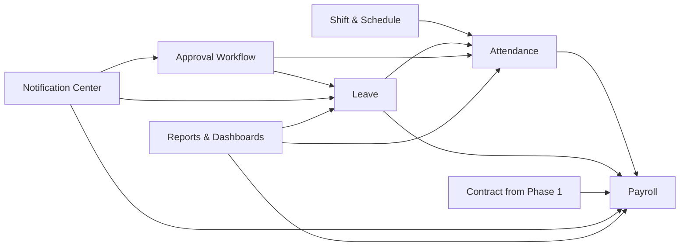

# Phase 2 Software Requirements Specification — Workforce Operations

Version: 0.1  
Date: 2026-06-30  
Status: Draft for review

## 1. Introduction

### 1.1 Purpose

This document defines the software requirements for Phase 2 of the eHRM system: Workforce Operations. Phase 2 manages daily workforce execution using the trusted identity, organization, employee, contract, configuration, and audit foundations from Phase 1.

### 1.2 Scope

Phase 2 includes:

1. Attendance
2. Shift & Work Schedule
3. Leave Management
4. Approval Workflow
5. Notification Center
6. Payroll Management
7. Reports & Dashboards

Phase 2 excludes:

- Recruitment pipeline management
- Onboarding/offboarding task orchestration
- Performance review cycles
- Training programs
- Asset lifecycle tracking
- Mobile app delivery
- Multi-tenant platform concerns

### 1.3 References

- `00-enterprise-srs.md`
- `01-core-platform-srs.md`
- `docs/ROADMAP.md`
- `docs/ROADMAP_DETAIL_1.md`
- `docs/ROADMAP_DETAIL_2.md`

### 1.4 Assumptions

- Phase 1 capabilities are implemented and stable.
- Employee, organization, contract, and configuration data are available as trusted upstream data.
- Queue workers exist for asynchronous calculations, imports, exports, and notification fan-out.
- Payroll is initially single-country, with Vietnamese labor context as baseline.

## 2. System Overview

### 2.1 Phase Boundary

Phase 2 turns employee master data into operational HR flows.



### 2.2 Primary Actors

| Actor | Phase 2 responsibilities |
| --- | --- |
| Employee | Check-in/out, submit leave/request forms, view balances and payslips. |
| Department Manager | Approve attendance adjustments, leave, overtime, and scoped requests. |
| HR Staff | Review attendance issues, maintain shift calendars, support leave and payroll inputs. |
| HR Manager | Owns policy settings, approvals, workforce oversight, and reporting. |
| Accountant/Payroll | Processes payroll periods, adjustments, approvals, and exports. |
| Admin | Maintains workflow, notification, and technical configuration. |

### 2.3 Phase 2 Success Outcome

At the end of Phase 2, the company can operate timekeeping, leave, approvals, notifications, and monthly payroll with traceability and auditable controls.

## 3. Functional Requirements

## 3.1 Attendance

### 3.1.1 Description

The system shall collect attendance inputs, normalize raw logs, apply schedule and approved leave context, and produce employee timesheets for workforce operations and payroll.

### 3.1.2 Functional Requirements

| ID | Requirement |
| --- | --- |
| ATT-FR-001 | The system shall capture attendance from supported sources including web, manual entry, import, device logs, and GPS-backed check-in when enabled. |
| ATT-FR-002 | The system shall store raw attendance logs separately from calculated attendance results. |
| ATT-FR-003 | The system shall calculate daily attendance outcomes using shift schedule, approved leave, holidays, weekends, and configured attendance rules. |
| ATT-FR-004 | The system shall support late arrival, early departure, absence, overtime, and attendance adjustment scenarios. |
| ATT-FR-005 | The system shall support cross-day and overnight shifts. |
| ATT-FR-006 | The system shall support manual attendance adjustment requests requiring approval. |
| ATT-FR-007 | The system shall maintain calculated timesheets by employee and payroll period. |
| ATT-FR-008 | The system shall preserve recalculation auditability when approved requests or shift assignments change. |
| ATT-FR-009 | The system shall support monthly attendance closing to stabilize payroll inputs. |

### 3.1.3 Business Rules

- Raw logs are source-of-truth inputs; calculated timesheets are derived records.
- Attendance calculation must consider approved leave before marking absence.
- Attendance adjustments must not silently overwrite original raw logs.
- Cross-day shifts must attribute worked time to configured payroll/date policies.
- Closed attendance periods require privileged reopening with audit.

### 3.1.4 Data Model Sketch

Core entities:

- AttendanceRawLog
- AttendanceTimesheet
- AttendanceDailyResult
- AttendanceAdjustmentRequest
- AttendanceSource
- AttendancePeriod

### 3.1.5 Use Case — Employee Requests Attendance Adjustment

1. Employee views daily attendance record.
2. Employee submits adjustment reason and evidence.
3. System validates request window and duplicate submission rules.
4. Workflow engine routes request to approver(s).
5. Approved result triggers attendance recalculation.
6. System audits request and recalculation.

## 3.2 Shift & Work Schedule

### 3.2.1 Description

The system shall define shift templates and assign work schedules to employees or groups.

### 3.2.2 Functional Requirements

| ID | Requirement |
| --- | --- |
| SHF-FR-001 | The system shall manage shift templates including start/end times, breaks, tolerance rules, and overtime thresholds. |
| SHF-FR-002 | The system shall support normal, flexible, remote, split, and overnight shifts when configured. |
| SHF-FR-003 | The system shall assign shifts to employees, departments, or groups for date ranges. |
| SHF-FR-004 | The system shall support shift change and shift swap requests requiring approval when configured. |
| SHF-FR-005 | The system shall support recurring schedules and ad hoc overrides. |
| SHF-FR-006 | The system shall expose scheduled shift data to attendance calculation and employee self-service views. |
| SHF-FR-007 | The system shall audit shift template and assignment changes. |

### 3.2.3 Business Rules

- Shift assignments with overlapping effective ranges must be blocked or resolved deterministically.
- Overnight shifts must define how attendance is mapped to date and payroll period.
- Flexible shifts still require rule-based lateness/absence interpretation when enabled.
- Shift changes after attendance close require privileged override and audit.

### 3.2.4 Use Case — HR Assigns Monthly Shift Schedule

1. HR selects employee set or department.
2. HR chooses shift template and date range.
3. System validates no conflicting active schedule.
4. System saves assignments.
5. System queues attendance recalculation for impacted days if needed.
6. System audits change.

## 3.3 Leave Management

### 3.3.1 Description

The system shall manage leave types, balances, requests, approvals, holiday interplay, and leave usage reporting.

### 3.3.2 Functional Requirements

| ID | Requirement |
| --- | --- |
| LEA-FR-001 | The system shall support configurable leave types including annual leave, sick leave, unpaid leave, maternity leave, and company-specific types. |
| LEA-FR-002 | The system shall maintain leave balances when balance-tracked leave types apply. |
| LEA-FR-003 | The system shall support full-day, half-day, and configured hourly leave requests. |
| LEA-FR-004 | The system shall validate leave requests against policy, balance, holidays, overlaps, and request windows. |
| LEA-FR-005 | The system shall route leave requests through approval workflow. |
| LEA-FR-006 | The system shall reflect approved leave into attendance and payroll inputs. |
| LEA-FR-007 | The system shall support leave cancellation and modification rules. |
| LEA-FR-008 | The system shall support carry-forward and expiry rules where configured. |
| LEA-FR-009 | The system shall expose leave calendars for authorized users. |

### 3.3.3 Business Rules

- Balance deduction occurs only when leave is approved or reaches configured approval stage.
- Approved leave supersedes absence classification for the same approved period.
- Leave cancellation after payroll close requires special handling and audit.
- Holiday and weekend treatment depends on leave policy configuration.

### 3.3.4 Use Case — Employee Applies for Annual Leave

1. Employee selects leave type and date/time range.
2. System previews requested duration and remaining balance.
3. System validates policy and overlap rules.
4. System submits request to workflow engine.
5. Approver approves or rejects with reason.
6. System updates leave balance and attendance impact on approval.
7. System sends notification and records audit logs.

## 3.4 Approval Workflow

### 3.4.1 Description

The system shall provide a shared workflow engine for approvals used by leave, attendance adjustment, overtime, shift change, payroll review, and later modules.

### 3.4.2 Functional Requirements

| ID | Requirement |
| --- | --- |
| WFL-FR-001 | The system shall define workflow templates by request type. |
| WFL-FR-002 | The system shall support sequential multi-step approval. |
| WFL-FR-003 | The system shall support conditional routing based on attributes such as duration, amount, branch, department, or role. |
| WFL-FR-004 | The system shall support approve, reject, cancel, and return-for-edit actions. |
| WFL-FR-005 | The system shall support approver delegation for date ranges when configured. |
| WFL-FR-006 | The system shall maintain full request history, comments, and timestamps. |
| WFL-FR-007 | The system shall notify pending approvers and request submitters of status changes. |
| WFL-FR-008 | The system shall audit template changes and approval decisions. |

### 3.4.3 Business Rules

- Request status changes must be deterministic and traceable.
- Approval template changes affect new requests only unless explicitly migrated.
- Delegated approval must preserve original approver context in audit history.
- Requests already consumed by payroll or attendance close may require reversal/reopen process, not silent edit.

### 3.4.4 Use Case — Manager Approves Leave Request

1. Manager receives pending approval notification.
2. Manager opens request details.
3. System shows request context, balance impact, and employee schedule context.
4. Manager approves or rejects with comment when required.
5. System updates workflow state.
6. System triggers downstream updates and notifications.
7. System audits decision.

## 3.5 Notification Center

### 3.5.1 Description

The system shall send operational notifications for approvals, expiry reminders, payroll publication, and workforce events.

### 3.5.2 Functional Requirements

| ID | Requirement |
| --- | --- |
| NTF-FR-001 | The system shall support in-app notifications. |
| NTF-FR-002 | The system shall support email notifications. |
| NTF-FR-003 | The system should support optional SMS/Zalo/Web Push through provider integrations when enabled. |
| NTF-FR-004 | The system shall trigger notifications for approval tasks, request status changes, contract/document expiry reminders, and payroll publication. |
| NTF-FR-005 | The system shall maintain notification templates with variables. |
| NTF-FR-006 | The system shall track notification delivery state when channels provide delivery feedback. |
| NTF-FR-007 | The system shall support user-level notification preferences where allowed by policy. |

### 3.5.3 Business Rules

- Security-sensitive notices may ignore user opt-out if mandatory.
- Notification failure must not invalidate approved business records.
- High-volume fan-out should run asynchronously.

## 3.6 Payroll Management

### 3.6.1 Description

The system shall calculate payroll using employee, contract, attendance, leave, allowance, deduction, and configuration inputs, then publish controlled payroll outputs.

### 3.6.2 Functional Requirements

| ID | Requirement |
| --- | --- |
| PAY-FR-001 | The system shall define payroll periods. |
| PAY-FR-002 | The system shall calculate payroll for employees in a selected period using configured formulas and inputs. |
| PAY-FR-003 | The system shall support salary components including base salary, allowances, bonus, penalties, overtime, deductions, insurance, tax, and net pay. |
| PAY-FR-004 | The system shall support payroll adjustments before final approval. |
| PAY-FR-005 | The system shall allow authorized payroll users to review, approve, lock, and publish payroll. |
| PAY-FR-006 | The system shall prevent ordinary edits to locked payroll records. |
| PAY-FR-007 | The system shall generate employee payslips. |
| PAY-FR-008 | The system shall support payroll exports for bank transfer or accounting integration. |
| PAY-FR-009 | The system shall audit calculation runs, adjustments, approvals, locks, publications, and exports. |

### 3.6.3 Business Rules

- Payroll must use effective-dated contract and employment data for the payroll period.
- Locked payroll periods are immutable except via privileged corrective workflow.
- Formula configuration must be versioned or otherwise traceable by payroll run.
- Payslips contain sensitive PII and compensation data and require strict access control.
- Payroll calculation may run asynchronously for large employee sets.

### 3.6.4 Data Model Sketch

Core entities:

- PayrollPeriod
- PayrollRun
- PayrollEntry
- PayrollComponent
- PayrollAdjustment
- Payslip
- PayrollExport

### 3.6.5 Use Case — Payroll Officer Runs Monthly Payroll

1. Payroll officer opens target payroll period.
2. System verifies attendance close and required inputs.
3. Payroll officer starts payroll run.
4. System calculates entries asynchronously if needed.
5. Payroll officer reviews exceptions and adjustments.
6. Payroll officer submits payroll for approval.
7. Authorized approver approves and locks payroll.
8. System publishes payslips and records audit logs.

## 3.7 Reports & Dashboards

### 3.7.1 Description

The system shall provide operational dashboards and reports for attendance, leave, payroll, and workforce trends.

### 3.7.2 Functional Requirements

| ID | Requirement |
| --- | --- |
| RPT-FR-001 | The system shall provide role-based dashboards for HR, manager, and payroll users. |
| RPT-FR-002 | The system shall provide reports for attendance, lateness, leave usage, payroll summaries, and approval workload. |
| RPT-FR-003 | The system shall support filtering by branch, department, employee, date range, and status within user data scope. |
| RPT-FR-004 | The system shall support export of authorized report results. |
| RPT-FR-005 | The system shall log report export actions. |

### 3.7.3 Business Rules

- Report data visibility follows the same permission and data-scope rules as transactional APIs.
- Payroll reports may require stricter permissions than general HR reports.
- Large exports should run asynchronously.

## 4. Cross-Module Workflow

### 4.1 Monthly Workforce Operations Cycle

```text
Admin/HR configures shifts, leave types, workflow, payroll settings
  -> Employees check in/out and submit requests
  -> Managers/HR approve requests
  -> Attendance engine calculates daily timesheets
  -> Attendance period closes
  -> Payroll runs using attendance + leave + contract data
  -> Payroll approved, locked, published
  -> Dashboards/reports expose outcomes
```

## 5. Interface Requirements

### 5.1 API Categories

- `/attendance/*`
- `/attendance-adjustments/*`
- `/shifts/*`
- `/schedules/*`
- `/leave-types/*`
- `/leave-requests/*`
- `/workflow/*`
- `/notifications/*`
- `/payroll/*`
- `/reports/*`

### 5.2 UI Categories

- Employee attendance self-service
- Shift calendar and assignment screens
- Leave request and approval screens
- Approval inbox
- Payroll period, run, review, and payslip screens
- Workforce dashboards

## 6. Non-Functional Requirements

### 6.1 Performance

- Daily attendance query and employee self-service views should respond within 500 ms p95 for common filters.
- Payroll run may be asynchronous and should provide progress visibility.
- Large report exports should not block interactive traffic.

### 6.2 Security

- Attendance and leave actions require authenticated users.
- Payroll APIs require stricter role-based access and data masking where appropriate.
- Payslip access shall be restricted to employee self and authorized payroll/HR roles.

### 6.3 Reliability

- Attendance calculation and payroll calculation must be repeatable and traceable.
- Partial failures in notification or export should not corrupt approved payroll or leave records.

## 7. Acceptance Criteria

1. Employees can check in/out and submit attendance adjustments.
2. HR can define and assign shifts.
3. Employees can apply leave; managers can approve/reject.
4. Workflow templates route requests correctly.
5. Notifications are sent for pending approvals and status changes.
6. Attendance results feed payroll.
7. Payroll can be calculated, approved, locked, and published.
8. Authorized users can view dashboards and export reports within scope.
9. All material actions are audited.

## 8. Deferred to Later Phases

- Recruitment-related approvals
- Performance-linked compensation rules
- Mobile push experience
- Advanced analytics and forecasting
