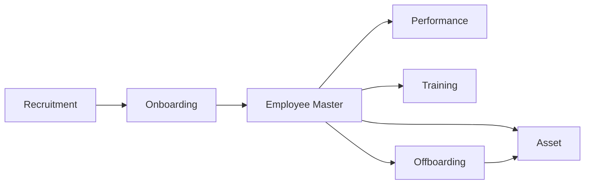

# Phase 3 Software Requirements Specification — Talent Lifecycle

Version: 0.1  
Date: 2026-06-30  
Status: Draft for review

## 1. Introduction

### 1.1 Purpose

This document defines the software requirements for Phase 3 of the eHRM system: Talent Lifecycle. Phase 3 extends the platform from workforce operations into talent acquisition, employee development, and controlled exit workflows.

### 1.2 Scope

Phase 3 includes:

1. Recruitment
2. Onboarding
3. Offboarding
4. Performance Management
5. Training Management
6. Asset Management

### 1.3 References

- `00-enterprise-srs.md`
- `01-core-platform-srs.md`
- `02-workforce-ops-srs.md`
- `docs/ROADMAP.md`
- `docs/ROADMAP_DETAIL_1.md`
- `docs/ROADMAP_DETAIL_2.md`

### 1.4 Assumptions

- Phase 1 and Phase 2 are available.
- Shared workflow, notifications, documents, configuration, and audit capabilities are reusable.
- Employee master remains the authoritative target state after successful hiring and onboarding.

## 2. System Overview

### 2.1 Phase Boundary

Phase 3 covers the talent lifecycle from candidate to onboarding, growth, and exit.



### 2.2 Primary Actors

| Actor | Phase 3 responsibilities |
| --- | --- |
| Recruiter | Manage requisitions, candidates, interviews, offers. |
| Interviewer | Submit candidate evaluations. |
| HR Staff | Drive onboarding/offboarding and documentation. |
| Department Manager | Request headcount, interview, approve onboarding/offboarding tasks, review performance. |
| Employee | Complete self-service onboarding/offboarding tasks, reviews, and training. |
| Trainer | Manage training courses and results. |
| IT/Admin Support | Prepare/recover accounts and assets. |

## 3. Functional Requirements

## 3.1 Recruitment

### 3.1.1 Description

The system shall manage recruitment requests, job postings, candidate records, interview pipeline, evaluations, and offer transition to employee onboarding.

### 3.1.2 Functional Requirements

| ID | Requirement |
| --- | --- |
| REC-FR-001 | The system shall allow authorized users to create recruitment requisitions. |
| REC-FR-002 | The system shall track requisition status through approval, open, on-hold, closed, and cancelled states. |
| REC-FR-003 | The system shall manage candidate profiles with source, CV, contact data, and application history. |
| REC-FR-004 | The system shall detect candidate duplicates by configured identity keys such as email or phone. |
| REC-FR-005 | The system shall support interview scheduling and interviewer assignment. |
| REC-FR-006 | The system shall collect interviewer scorecards and comments. |
| REC-FR-007 | The system shall support candidate pipeline stages and status transitions. |
| REC-FR-008 | The system shall support offer generation and candidate-to-employee conversion on hire. |
| REC-FR-009 | The system shall audit candidate status changes, offer decisions, and employee conversion. |

### 3.1.3 Business Rules

- Candidate records should avoid duplicate fragmentation.
- Offer acceptance is required before candidate-to-employee conversion unless policy states otherwise.
- Hired candidates must create or link to an employee record rather than remain detached.

## 3.2 Onboarding

### 3.2.1 Description

The system shall manage onboarding checklists, task assignment, document collection, account readiness, and employee readiness milestones.

### 3.2.2 Functional Requirements

| ID | Requirement |
| --- | --- |
| ONB-FR-001 | The system shall allow onboarding templates by role, department, or location. |
| ONB-FR-002 | The system shall create onboarding plans for new hires. |
| ONB-FR-003 | The system shall assign onboarding tasks to HR, manager, IT, admin support, and employee. |
| ONB-FR-004 | The system shall track task status, owner, due date, and completion proof where needed. |
| ONB-FR-005 | The system shall support pre-start and post-start onboarding steps. |
| ONB-FR-006 | The system shall notify task owners of pending or overdue work. |
| ONB-FR-007 | The system shall audit onboarding creation and completion actions. |

### 3.2.3 Business Rules

- Onboarding may start before employee first working day.
- Critical tasks such as account creation or mandatory documents may be marked blocking.
- Onboarding completion should update employee readiness state but not overwrite employee master history.

## 3.3 Offboarding

### 3.3.1 Description

The system shall manage resignation, approval, handover, asset return, account closure, exit data capture, and final offboarding completion.

### 3.3.2 Functional Requirements

| ID | Requirement |
| --- | --- |
| OFF-FR-001 | The system shall support offboarding initiation from resignation or company-initiated separation workflows. |
| OFF-FR-002 | The system shall create offboarding checklists with accountable owners. |
| OFF-FR-003 | The system shall track handover tasks, asset returns, account closure, and exit approvals. |
| OFF-FR-004 | The system shall capture resignation reason and effective leaving date. |
| OFF-FR-005 | The system shall support final clearance status. |
| OFF-FR-006 | The system shall support linkage to final payroll processing inputs. |
| OFF-FR-007 | The system shall audit offboarding actions. |

### 3.3.3 Business Rules

- Offboarding completion requires all mandatory clearance tasks complete or explicitly waived.
- Account disablement timing must follow policy and approved leaving date.
- Final payroll dependencies must be visible before offboarding closure.

## 3.4 Performance Management

### 3.4.1 Description

The system shall support periodic performance planning, self-review, manager review, weighted scoring, and performance outcomes.

### 3.4.2 Functional Requirements

| ID | Requirement |
| --- | --- |
| PRF-FR-001 | The system shall define performance cycles. |
| PRF-FR-002 | The system shall support goals, KPIs, OKRs, competencies, or configured review criteria. |
| PRF-FR-003 | The system shall support self-assessment and manager assessment. |
| PRF-FR-004 | The system shall support weighted scoring. |
| PRF-FR-005 | The system shall support manager comments and performance conclusions. |
| PRF-FR-006 | The system shall restrict visibility of performance reviews to authorized participants. |
| PRF-FR-007 | The system shall audit review submissions and final outcomes. |

### 3.4.3 Business Rules

- Active performance cycle configuration should remain stable once reviews begin.
- Weight totals must validate to configured rules.
- Final results may inform future compensation or promotion processes but should not automatically change payroll in this phase.

## 3.5 Training Management

### 3.5.1 Description

The system shall manage internal training catalog, sessions, enrollment, attendance, and training results.

### 3.5.2 Functional Requirements

| ID | Requirement |
| --- | --- |
| TRN-FR-001 | The system shall manage training courses and sessions. |
| TRN-FR-002 | The system shall allow employee enrollment or assignment. |
| TRN-FR-003 | The system shall track attendance and completion status. |
| TRN-FR-004 | The system shall record training results or certifications where applicable. |
| TRN-FR-005 | The system shall notify participants of schedule and completion events. |
| TRN-FR-006 | The system shall audit training record changes. |

## 3.6 Asset Management

### 3.6.1 Description

The system shall track employee-assigned company assets through issuance, custody, condition changes, and return.

### 3.6.2 Functional Requirements

| ID | Requirement |
| --- | --- |
| AST-FR-001 | The system shall manage asset inventory records. |
| AST-FR-002 | The system shall assign assets to employees. |
| AST-FR-003 | The system shall record issue date, expected return date, condition, and status. |
| AST-FR-004 | The system shall support return, loss, damage, and replacement workflows. |
| AST-FR-005 | The system shall expose asset obligations in offboarding clearance. |
| AST-FR-006 | The system shall audit asset lifecycle changes. |

## 4. Cross-Module Workflow

### 4.1 Hire-to-Employee Flow

```text
Headcount request approved
  -> Recruitment requisition opened
  -> Candidate pipeline processed
  -> Offer accepted
  -> Candidate converted to employee/onboarding record
  -> Onboarding tasks executed
  -> Employee becomes operational in core/workforce modules
```

### 4.2 Exit Flow

```text
Resignation/termination initiated
  -> Offboarding tasks created
  -> Asset return + access closure + final clearance
  -> Final payroll dependencies confirmed
  -> Employee status updated to resigned/archived
```

## 5. Interface Requirements

### 5.1 API Categories

- `/recruitment/*`
- `/candidates/*`
- `/interviews/*`
- `/offers/*`
- `/onboarding/*`
- `/offboarding/*`
- `/performance/*`
- `/training/*`
- `/assets/*`

### 5.2 UI Categories

- Recruitment dashboard and candidate pipeline
- Onboarding checklist views
- Offboarding clearance views
- Performance cycle/review screens
- Training catalog/session screens
- Asset inventory and assignment screens

## 6. Non-Functional Requirements

### 6.1 Performance

- Pipeline and checklist screens should provide responsive filtering and search.
- Bulk task generation and notification fan-out should run asynchronously when needed.

### 6.2 Security

- Candidate and employee data must follow privacy controls.
- Performance reviews require strict access boundaries.
- Asset and offboarding actions must be auditable.

## 7. Acceptance Criteria

1. Recruiters can manage requisitions, candidates, interviews, and offers.
2. Hired candidate can convert into employee/onboarding flow.
3. Onboarding tasks can be assigned and tracked.
4. Offboarding tasks can be assigned, completed, and audited.
5. Performance cycles and reviews can be executed.
6. Training sessions and results can be tracked.
7. Assets can be assigned and returned.

## 8. Deferred to Later Phases

- External career site optimization
- Deep succession planning
- Advanced talent analytics
