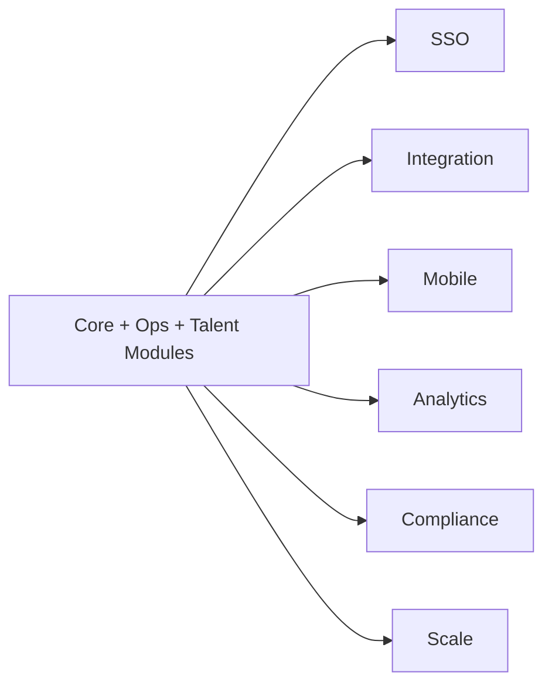

# Phase 4 Software Requirements Specification — Enterprise Extensions

Version: 0.1  
Date: 2026-06-30  
Status: Draft for review

## 1. Introduction

### 1.1 Purpose

This document defines the software requirements for Phase 4 of the eHRM system: Enterprise Extensions. This phase hardens the platform for broader enterprise controls, advanced integrations, mobile readiness, and operational scale.

### 1.2 Scope

Phase 4 includes:

1. SSO & Advanced Identity Controls
2. Advanced Integration Hub
3. Mobile Readiness & Self-Service Extensions
4. Advanced Analytics & Executive Reporting
5. Compliance Extensions
6. Scale Hardening & Operational Controls

### 1.3 References

- `00-enterprise-srs.md`
- `01-core-platform-srs.md`
- `02-workforce-ops-srs.md`
- `03-talent-lifecycle-srs.md`
- `docs/ROADMAP.md`
- `docs/ROADMAP_DETAIL_1.md`
- `docs/ROADMAP_DETAIL_2.md`

### 1.4 Assumptions

- Phases 1–3 are stable enough to extend rather than redesign.
- Enterprise leadership requires stronger controls, broader reporting, and more ecosystem connectivity.
- API-first architecture remains the base for mobile and integration clients.

## 2. System Overview

### 2.1 Phase Boundary

Phase 4 adds enterprise-grade control planes and extension capabilities rather than redefining core HR business domains.



## 3. Functional Requirements

## 3.1 SSO & Advanced Identity Controls

### 3.1.1 Description

The system shall support enterprise identity federation and stronger access controls.

### 3.1.2 Functional Requirements

| ID | Requirement |
| --- | --- |
| IAMX-FR-001 | The system shall support SSO through standards-based identity providers when enabled. |
| IAMX-FR-002 | The system shall support role and attribute mapping from external identity providers where configured. |
| IAMX-FR-003 | The system shall support stronger session controls such as forced logout, session revocation, and device/session visibility. |
| IAMX-FR-004 | The system should support MFA for privileged accounts when enabled. |
| IAMX-FR-005 | The system shall audit SSO login and federation mapping events. |

## 3.2 Advanced Integration Hub

### 3.2.1 Description

The system shall support controlled integrations with external systems and providers.

### 3.2.2 Functional Requirements

| ID | Requirement |
| --- | --- |
| INT-FR-001 | The system shall manage integration credentials securely. |
| INT-FR-002 | The system shall support outbound webhooks or event notifications where appropriate. |
| INT-FR-003 | The system shall support import/export connectors for accounting, banking, attendance devices, or ERP systems. |
| INT-FR-004 | The system shall log integration runs, failures, and retries. |
| INT-FR-005 | The system shall isolate integration failure from core transaction integrity. |

## 3.3 Mobile Readiness & Self-Service Extensions

### 3.3.1 Description

The system shall expose stable APIs and capabilities needed by future employee/manager mobile use cases.

### 3.3.2 Functional Requirements

| ID | Requirement |
| --- | --- |
| MOB-FR-001 | The system shall expose APIs suitable for employee and manager self-service clients. |
| MOB-FR-002 | The system should support mobile use cases such as attendance, leave, approvals, payslip view, notifications, and profile view. |
| MOB-FR-003 | The system shall protect mobile APIs with the same permission and data-scope rules as web clients. |
| MOB-FR-004 | The system should support push-notification-ready event hooks when mobile channel is introduced. |

## 3.4 Advanced Analytics & Executive Reporting

### 3.4.1 Description

The system shall provide higher-level workforce analytics, cross-module trend reporting, and executive summary views.

### 3.4.2 Functional Requirements

| ID | Requirement |
| --- | --- |
| ANL-FR-001 | The system shall provide executive workforce KPIs such as headcount trends, turnover, leave trends, attendance discipline, payroll cost, and recruitment funnel metrics. |
| ANL-FR-002 | The system shall support role-based executive dashboards. |
| ANL-FR-003 | The system shall support asynchronous generation of large analytical reports. |
| ANL-FR-004 | The system should support drill-down from summary metrics to authorized detail views. |

## 3.5 Compliance Extensions

### 3.5.1 Description

The system shall support stronger governance, privacy, and compliance controls.

### 3.5.2 Functional Requirements

| ID | Requirement |
| --- | --- |
| CMP-FR-001 | The system shall support configurable retention and archival rules for selected record types. |
| CMP-FR-002 | The system shall support enhanced export/download auditability for sensitive data. |
| CMP-FR-003 | The system should support policy-driven masking of sensitive fields. |
| CMP-FR-004 | The system shall support evidence gathering for audits of payroll, employee data changes, and approval trails. |
| CMP-FR-005 | The system shall support backup/recovery operational documentation and execution evidence. |

## 3.6 Scale Hardening & Operational Controls

### 3.6.1 Description

The system shall add technical controls needed as data volume and business criticality increase.

### 3.6.2 Functional Requirements

| ID | Requirement |
| --- | --- |
| SCL-FR-001 | The system shall support large-table indexing and partitioning strategies where required by data growth. |
| SCL-FR-002 | The system shall support background processing visibility for heavy jobs. |
| SCL-FR-003 | The system shall expose operational metrics and failure visibility for queues, integrations, and scheduled jobs. |
| SCL-FR-004 | The system shall support disaster recovery procedures and validation activities. |
| SCL-FR-005 | The system should support archive strategies for historical HR data without breaking required reporting. |

## 4. Cross-Module Outcome

### 4.1 Enterprise-Ready Platform

```text
Core domains stable
  -> Identity federated when needed
  -> External systems integrated safely
  -> Mobile self-service enabled via APIs
  -> Executive analytics expanded
  -> Compliance posture strengthened
  -> Scale operations hardened
```

## 5. Interface Requirements

### 5.1 API Categories

- `/sso/*`
- `/integrations/*`
- `/webhooks/*`
- `/mobile/*` (logical capability grouping, may map to existing APIs)
- `/analytics/*`
- `/compliance/*`
- `/ops/*`

## 6. Non-Functional Requirements

### 6.1 Security

- SSO, MFA, and integration secrets require stronger governance.
- Compliance exports and executive analytics must preserve least privilege.

### 6.2 Performance

- Analytical and archival operations should not degrade interactive HR workflows.
- Heavy integration and reporting tasks should be asynchronous.

### 6.3 Reliability

- Recovery procedures must be documented and testable.
- Integration retries must be bounded and observable.

## 7. Acceptance Criteria

1. Enterprise SSO can be enabled without breaking local authorization rules.
2. External integrations can be configured, executed, monitored, and audited.
3. APIs are stable enough for future mobile clients.
4. Executive dashboards and analytics are available to authorized roles.
5. Compliance-related retention, audit, and masking controls are available.
6. Operational hardening supports larger data volume and business criticality.

## 8. Deferred Beyond Current Roadmap

- Full multi-tenant SaaS transformation
- Full microservice decomposition
- Global multi-country payroll localization pack
