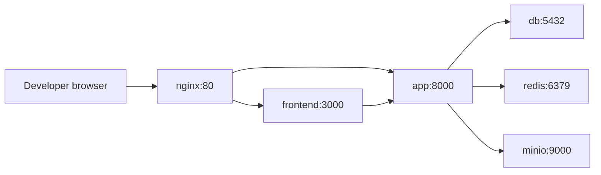

# M1 Nginx Proxy Design

Version: 0.1
Date: 2026-07-01
Status: Design approved

## 1. Scope

Refactor M1 Docker Compose to route all external HTTP traffic through nginx reverse proxy. Services no longer expose host ports directly; only nginx maps host port 80.

Applies to dev environment; production split will reuse same nginx image with TLS overrides later.

## 2. Architecture



Host resolution via `/etc/hosts`:
- `ihrm.test` → `127.0.0.1`
- `api.ihrm.test` → `127.0.0.1`

## 3. Changes

### docker-compose.yml

Add nginx service; change `ports` to `expose` for app/frontend/db/redis/minio.

```yaml
name: ihrm

services:
  nginx:
    image: nginx:1.27-alpine
    depends_on:
      - app
      - frontend
    ports:
      - "${NGINX_PORT:-80}:80"
    volumes:
      - ./docker/nginx/conf.d:/etc/nginx/conf.d:ro

  app:
    build:
      context: .
      dockerfile: docker/php/Dockerfile
    working_dir: /app/src/backend
    depends_on:
      db:
        condition: service_healthy
      minio:
        condition: service_healthy
      redis:
        condition: service_started
    env_file:
      - .env
    environment:
      APP_ENV: ${APP_ENV:-local}
      DB_CONNECTION: pgsql
      DB_HOST: db
      DB_PORT: 5432
      DB_DATABASE: ${DB_DATABASE:-ihrm}
      DB_USERNAME: ${DB_USERNAME:-ihrm}
      DB_PASSWORD: ${DB_PASSWORD:-ihrm}
      REDIS_HOST: redis
      REDIS_PORT: 6379
      MINIO_ENDPOINT: http://minio:9000
      MINIO_ACCESS_KEY: ${MINIO_ACCESS_KEY:-ihrm}
      MINIO_SECRET_KEY: ${MINIO_SECRET_KEY:-ihrm_secret}
      MINIO_BUCKET: ${MINIO_BUCKET:-ihrm-documents}
    expose:
      - "8000"
    volumes:
      - .:/app

  frontend:
    build:
      context: .
      dockerfile: docker/nextjs/Dockerfile
    working_dir: /app/src/frontend
    depends_on:
      - app
    expose:
      - "3000"
    volumes:
      - .:/app

  db:
    image: postgres:16-alpine
    environment:
      POSTGRES_DB: ${DB_DATABASE:-ihrm}
      POSTGRES_USER: ${DB_USERNAME:-ihrm}
      POSTGRES_PASSWORD: ${DB_PASSWORD:-ihrm}
    healthcheck:
      test: ["CMD-SHELL", "pg_isready -U ${DB_USERNAME:-ihrm}"]
      interval: 5s
      timeout: 3s
      retries: 5
    expose:
      - "5432"
    volumes:
      - pgdata:/var/lib/postgresql/data

  redis:
    image: redis:7-alpine
    healthcheck:
      test: ["CMD", "redis-cli", "ping"]
      interval: 5s
      timeout: 3s
      retries: 5
    expose:
      - "6379"

  minio:
    image: minio/minio:latest
    command: server --console-address ":9001" /data
    environment:
      MINIO_ROOT_USER: ${MINIO_ACCESS_KEY:-ihrm}
      MINIO_ROOT_PASSWORD: ${MINIO_SECRET_KEY:-ihrm_secret}
    healthcheck:
      test: ["CMD", "mc", "ready", "local"]
      interval: 5s
      timeout: 3s
      retries: 5
    expose:
      - "9000"
      - "9001"
    volumes:
      - miniodata:/data

volumes:
  pgdata:
  miniodata:
```

### docker/nginx/conf.d/default.conf

```nginx
server {
    listen 80;
    server_name ihrm.test;

    location / {
        proxy_pass http://frontend:3000;
        proxy_http_version 1.1;
        proxy_set_header Host $host;
        proxy_set_header X-Real-IP $remote_addr;
        proxy_set_header X-Forwarded-For $proxy_add_x_forwarded_for;
        proxy_set_header X-Forwarded-Proto $scheme;
        proxy_set_header Upgrade $http_upgrade;
        proxy_set_header Connection "upgrade";
    }
}

server {
    listen 80;
    server_name api.ihrm.test;

    location / {
        proxy_pass http://app:8000;
        proxy_http_version 1.1;
        proxy_set_header Host $host;
        proxy_set_header X-Real-IP $remote_addr;
        proxy_set_header X-Forwarded-For $proxy_add_x_forwarded_for;
        proxy_set_header X-Forwarded-Proto $scheme;
    }
}
```

### .env.example

```env
APP_ENV=local
APP_DEBUG=true
APP_URL=http://api.ihrm.test
FRONTEND_URL=http://ihrm.test

DB_CONNECTION=pgsql
DB_HOST=db
DB_PORT=5432
DB_DATABASE=ihrm
DB_USERNAME=ihrm
DB_PASSWORD=ihrm

REDIS_HOST=redis
REDIS_PORT=6379

MINIO_ENDPOINT=http://minio:9000
MINIO_ACCESS_KEY=ihrm
MINIO_SECRET_KEY=ihrm_secret
MINIO_BUCKET=ihrm-documents

NEXT_PUBLIC_API_URL=http://api.ihrm.test/api/v1
NGINX_PORT=80
```

### Host setup

Add to `/etc/hosts`:

```bash
echo "127.0.0.1 ihrm.test api.ihrm.test" | sudo tee -a /etc/hosts
```

### Validation

```bash
docker compose up -d --build
curl -I http://ihrm.test
curl -i http://api.ihrm.test/api/v1/users
docker compose ps
```

Expected:
- `ihrm.test` → 200
- `api.ihrm.test/api/v1/users` → 401 JSON
- Only nginx has host port

## 4. Acceptance Criteria

- `docker compose ps` shows only nginx with host port 80
- `curl http://ihrm.test` returns frontend HTML
- `curl http://api.ihrm.test/api/v1/users` returns 401 JSON error envelope
- `docker compose exec app php artisan test` passes
- No direct access to backend/frontend/db/redis/minio from host
- `.env.example`, `.env.local.example`, `.env.dev.example`, `.env.prod.example` updated
- `docker/nginx/conf.d/default.conf` created
- M1 plan updated with nginx notes
